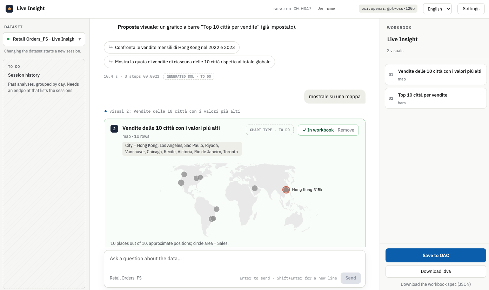
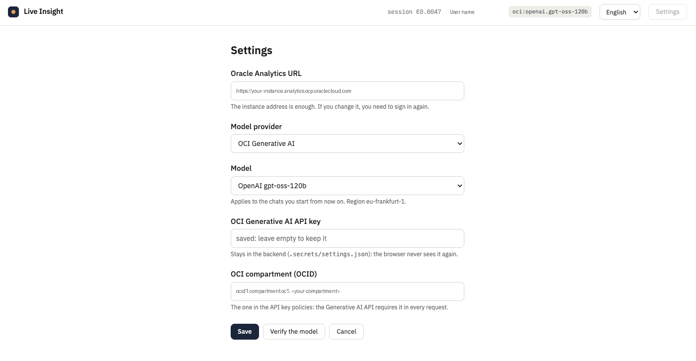

# Live Insight

An external AI assistant for **Oracle Analytics Cloud (OAC)**: chat with your data in your own language, get
visuals with a live preview, and save the ones you keep as a **native OAC workbook** — in the catalog or as a
`.dva` file — that opens and refreshes in OAC without any LLM.

It talks to OAC only through the official **OAC MCP server**, with the user's own identity and permissions. The
model never writes OAC JSON: it writes Logical SQL and small validated visual specifications; everything else is
deterministic code. You bring the LLM: OpenAI, Anthropic, OCI Generative AI, or any **OpenAI-compatible server**
(Ollama, vLLM, LM Studio…) running on your machine.

> **Status: closed (28 September 2026).** Live Insight was built to test whether an LLM layer outside OAC could
> answer data questions visibly better than working inside OAC. Our last experiment — a semantic profile of the
> dataset added to the prompt — did not pass the go/no-go threshold we set before measuring (+1.4 and +4.3 points
> against +15 required), so the project stops here. What remains is a working, tested reference for building an
> external assistant on OAC: the MCP integration, the sign-in flow, a generator of real OAC workbooks, and the
> lessons below. Contributions are welcome, reviewed on a best-effort basis (see [Contributing](#contributing)).

## Screenshots





## What it does

1. **Sign in** with your OAC user (the same OAuth flow as Oracle's `oac-mcp-connect` connector): queries run with
   your identity and permissions, no technical account.
2. **Pick a dataset** among those you can see.
3. **Chat** in any language: the model queries OAC in Logical SQL through MCP, answers with the numbers, proposes
   visuals (bar, line, table, pivot, scatter, map, tile…, with filters and sorting) with a Vega-Lite preview that
   runs the same expressions the workbook will run, and ends with clickable follow-ups.
4. **Build the workbook**: add the visuals you want, rename them, then **Save to OAC** (in a folder named
   "Live Insight - test", never overwriting) or **Download .dva** to import by hand.

The UI is in English and Italian (language picker in the top bar); answers follow the language of the question.

## What you need

### Required

| What | Notes |
|---|---|
| **Python 3.13+** and [uv](https://docs.astral.sh/uv/) | Backend |
| **Node.js** `^20.19` or `>=22.12` with npm | The web UI (Vite) |
| **An Oracle Analytics Cloud instance with the MCP server** | The OAC MCP server was released as a Preview in September 2026: see Oracle's documentation to make it available on your instance. The app calls `<OAC URL>/api/mcp` |
| **An OAC user** with access to at least one **dataset** | Tested on file-based datasets with a single table. Subject areas and datasets joining several tables are not supported |
| **One LLM with tool calling**, one of: | Chosen in the app's Settings (there is no default) |
| · OpenAI | an API key |
| · Anthropic | an API key |
| · OCI Generative AI | an API key for Generative AI, the **compartment OCID**, and the region if not `eu-frankfurt-1` (`OCI_REGION`) |
| · your own OpenAI-compatible server | its URL (e.g. `http://localhost:11434/v1` for Ollama), optionally a key, and a model that supports tools |

The browser must be able to reach `http://127.0.0.1:8000`: after sign-in OAC sends the tokens to
`http://127.0.0.1:8000/oac-mcp-connect/callback/<nonce>`, the same callback shape as Oracle's connector.

### Optional

| What | What it enables |
|---|---|
| A catalog folder named **"Live Insight - test"** | **Save to OAC**. It is the only folder the app writes to; create it in your catalog (it must be unique by name) |
| A **skeleton `.dva`**: an empty workbook exported **from the Data Visualization editor**, without data | **Download .dva**. Save it as `.secrets/skeleton.dva` or set `SKELETON_DVA`. Export it from the editor, not from the Catalog page (which includes the data even with the option off). Without it the download button is disabled; Save to OAC still works |
| `TEMPLATE_WORKBOOKS` | Read the visual templates from workbooks in your catalog (comma-separated names) instead of the bundled ones |
| A dev token (`OAC_TOKENS`) | The terminal chat (`liveinsight.cli`) and development without signing in through the UI: `uv run python -m liveinsight.platforms.oac.login` writes it |

## Install and run

```bash
git clone https://github.com/frasal-test/live-insight.git
cd live-insight
uv sync                                   # Python dependencies
npm install && npm --prefix web install   # npm dependencies (root and web/)
npm run dev                               # backend :8000 + frontend :5173
```

Open <http://localhost:5173>. The first time, **Settings** opens by itself: enter the OAC URL
(`https://<instance>.analytics.ocp.oraclecloud.com`), choose the provider and the model, paste the key (and the
compartment, or the server URL), press **Verify the model** — a test call that checks tool calling — then **Save**
and **Sign in with Oracle Analytics**.

Settings are saved in `.secrets/settings.json` (permissions 600, git-ignored); keys never go back to the browser.
Instead of the Settings page you can start from environment variables (see `.env.example`).

### Using your own LLM (example: Ollama)

```bash
ollama pull qwen3:14b          # any model with tool calling
```

In Settings choose **OpenAI-compatible server**, server URL `http://localhost:11434/v1`, model `qwen3:14b`, no key,
then **Verify the model**. The quality of answers depends a lot on the model (see below).

## Configuration reference

| Variable | Meaning |
|---|---|
| `OAC_URL` | OAC instance URL (Settings win over it) |
| `LLM_MODEL` | `provider:model`, e.g. `openai:gpt-5.6-luna@low`, `anthropic:claude-sonnet-5`, `oci:openai.gpt-oss-120b`, `custom:qwen3:14b` |
| `OPENAI_API_KEY`, `ANTHROPIC_API_KEY`, `OCI_GENAI_API_KEY`, `CUSTOM_LLM_API_KEY` | Provider keys |
| `OCI_COMPARTMENT_ID`, `OCI_REGION` | OCI Generative AI (native API); region default `eu-frankfurt-1` |
| `CUSTOM_LLM_BASE_URL` | Your OpenAI-compatible server |
| `SKELETON_DVA` | Skeleton `.dva` for the download (default `.secrets/skeleton.dva`) |
| `TEMPLATE_WORKBOOKS` | Catalog workbooks to use as visual templates (default: the bundled ones) |
| `OAC_TOKENS` | Dev token file (`.secrets/tokens.json`) |
| `SETTINGS_FILE`, `PUBLIC_URL`, `CALLBACK_URL` | Settings file, UI origin, backend origin as the browser reaches it |

## Commands

```bash
npm run dev                                                   # the app
uv run python -m liveinsight.cli --dataset "Retail Orders"    # terminal chat (needs OAC_TOKENS)
uv run python -m liveinsight.platforms.oac.login              # sign in from the terminal, writes the dev token
uv run python -m liveinsight.engine.spec                      # rewrites docs/workbook-spec.schema.json
```

## How it is built

Three blocks ([`docs/ARCHITETTURA.md`](docs/ARCHITETTURA.md), with diagrams):

```text
web/ + liveinsight/api.py        front: UI, languages, sign-in, settings
liveinsight/engine/              engine: chat loop, prompt, tools, previews, the WorkbookSpec contract
liveinsight/platforms/oac/       OAC adapter: MCP client, Logical SQL, catalog, .dva generator
```

- **The engine never imports the platform.** It talks to a `DataSource` (the data, in the platform's dialect) and a
  `WorkbookTarget` (the workbook), `liveinsight/engine/platform.py`; a test enforces it and runs the engine on a
  non-OAC in-memory source.
- **The WorkbookSpec** is the only thing that crosses from the engine to the platform: a versioned JSON with a
  published schema ([`docs/workbook-spec.schema.json`](docs/workbook-spec.schema.json)). The OAC target reads nothing
  else. "Download the workbook spec" in the UI shows it.
- **Workbooks from templates, not invented JSON.** Every visual starts as a clone of one OAC itself saved; the code
  swaps the columns at every level of the binding and runs structural checks before delivering. The templates made by
  hand in OAC are bundled, anonymised, in `liveinsight/platforms/oac/templates/`.
- **Previews tell the truth**: same queries and filter semantics as the workbook, Tufte-style charts, honest notes
  where Vega-Lite cannot draw what OAC will draw (radar, box plot, narrative).

## What we learned

- **The model matters more than the prompt engineering.** On our evaluations the best model scored far higher than
  an open-weights model on the same prompt (about +23 points on a 51-question benchmark, with a quarter of the
  hallucinations), while a semantic profile of the dataset added to the prompt moved the score by 1-4 points.
- **OAC Logical SQL has silent traps** (checked on OAC, now in the query guide the model reads,
  `liveinsight/platforms/oac/source.py`): `AVG({measure})` is the measure's default aggregate, not the average
  (use `AVG(OVERRIDEAGGR(...))`); expressions apply after aggregation, so `SUM(a * b)` is `SUM(a) x SUM(b)` and
  per-row calculations need a subquery that selects the row key; `NOT IN (subquery)` returns wrong counts without
  an error; `describe_data` gives no aggregation rule for measures.
- **Filters on a measure** in OAC are computed on all the data at the visual's grain, *without* the other filters,
  then combined with them; the preview reproduces this in two queries.
- **Tool descriptions steer weaker models more than the system prompt**, and their order matters: listing a
  "suggest follow-ups" tool before the "propose visual" tool made gpt-oss skip visuals.
- **Portable tool schemas**: no `$ref`/`const` (the gpt-oss renderer turns them into `any`) and no `oneOf` (Gemini
  on OCI); flat objects with a `kind` field work everywhere, and Pydantic still validates.
- **The `.dva` format** is a ZIP with a zlib catalog archive; a downloadable `.dva` must contain only the workbook,
  or OAC silently creates an empty copy of the dataset on import. Details in
  [`dva-lab/FORMATO-DVA.md`](dva-lab/FORMATO-DVA.md) and [`docs/SPIKE-MCP.md`](docs/SPIKE-MCP.md).

## Limitations

- A local, single-user tool: sessions live in memory, there is no persistence, and the backend is not hardened for
  a multi-user deployment.
- One dataset per chat, single-table datasets only, no subject areas.
- The sign-in and token-refresh endpoints are internal endpoints used by Oracle's connector, and the MCP server is a
  Preview: both can change.
- Tested on one sample dataset (Retail Orders) on one instance.

## Contributing

Pull requests and issues are welcome, but this is a closed side project maintained on a best-effort basis: replies
may take a while. Before opening a pull request:

- Keep code, comments and docs in English; every UI string goes in the JSON translation files.
- Never commit `.dva` files, secrets, OCIDs or your OAC instance host.

Forks are of course fine under the Apache-2.0 licence.

## Credits and licence

Licensed under the [Apache License 2.0](LICENSE). City coordinates from [GeoNames](https://www.geonames.org/)
(CC BY 4.0); world map from [world-atlas](https://github.com/topojson/world-atlas) (ISC), from Natural Earth data.
Oracle, Oracle Analytics and OCI are trademarks of Oracle; this project is not affiliated with or endorsed by Oracle.
