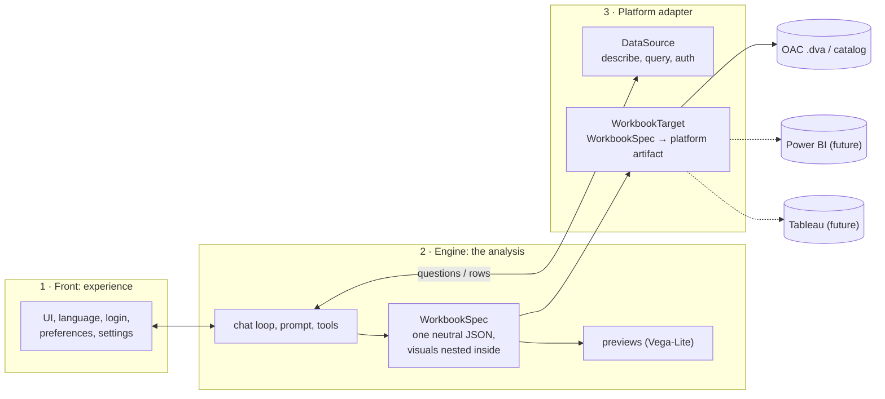
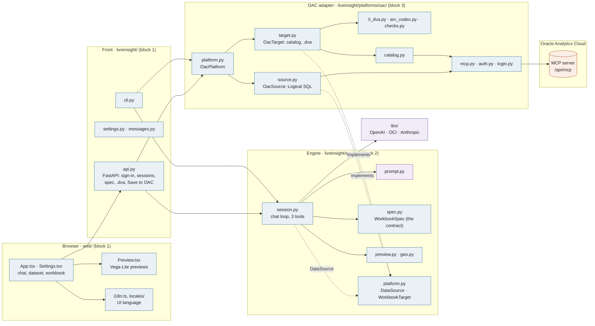
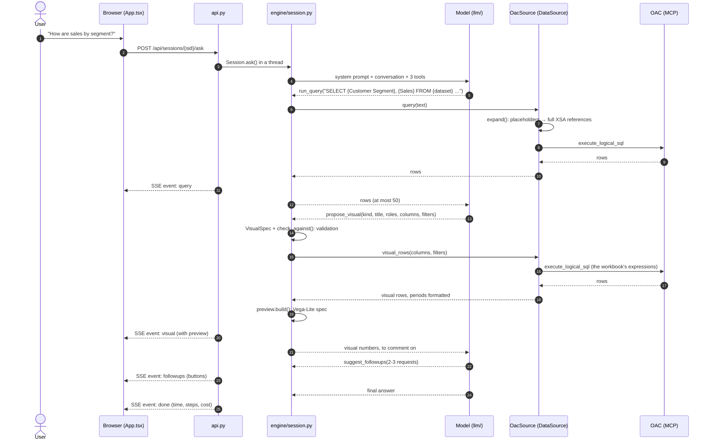
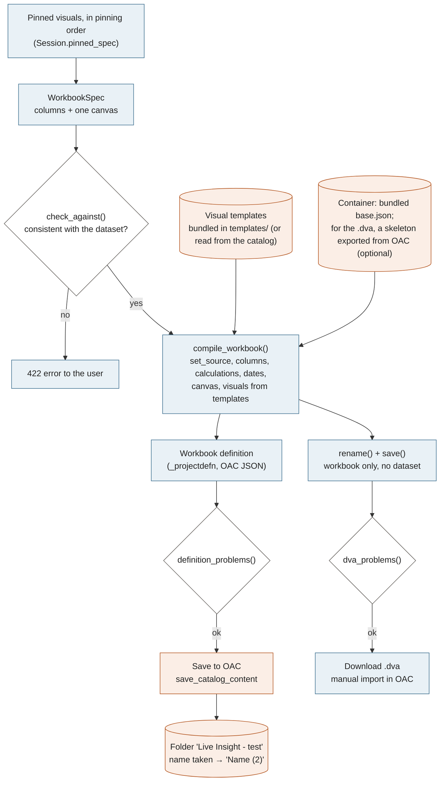
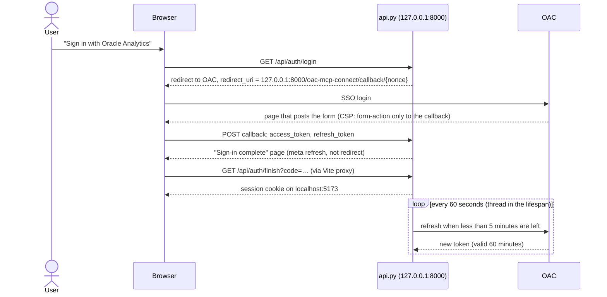

# Live Insight architecture

*Updated 28 September 2026, when the project was closed (see the README).*

Section 1 is the **target architecture** decided on 25/9: steps 1 and 2 are done, steps 3 and 4 were not pursued
before the project closed. Sections 2-7 describe **the code as it is**.

---

## 1. Target architecture (decided 25/9)

Three blocks, with the analysis in the middle and every platform-specific detail at the edges:

- **Front** (block 1): UI, language, login, preferences. It knows nothing about analysis or platforms beyond what
  it shows. UI strings come from `web/src/locales/*.json`; the user chats in their own language.
- **Engine** (block 2): leads the analysis: asks the data, chooses and proposes visuals, suggests follow-ups.
  Its only output towards the platform is **one JSON, the `WorkbookSpec`**: workbook → canvases → visuals
  (kind, title, roles, columns, sort, filters). The goal is to focus on the analysis, decoupled from the platform.
- **Platform adapter** (block 3): everything that depends on the analytics platform, with **two faces**:
  - `DataSource`: authentication, dataset listing and description, query execution. The engine reads data from
    the platform too, not only writes to it; a Power BI report needs a Power BI semantic model, a Tableau workbook a
    Tableau data source, so source and target normally belong to the same platform.
  - `WorkbookTarget`: translates the `WorkbookSpec` into the platform artifact (OAC `.dva` and catalog today;
    Power BI PBIP, Tableau `.twb` in the future). It also declares its **capabilities** (visual kinds, filters,
    calculations) so the engine only proposes what the target can build.
- **Previews** are a platform-neutral rendering of the spec (Vega-Lite): in practice a target of their own.

### Query language: a split decision

- **Workbook: neutral.** The `WorkbookSpec` is what ends up on the platform, so it must not contain a platform
  dialect. Calculations are described as named operations where possible (share of total, change, rank); a
  platform expression stays allowed as an escape hatch, marked as platform-specific.
- **Exploratory queries: platform dialect.** `run_query` serves only the answer and never reaches the workbook.
  The model writes the dialect of the source (Logical SQL for OAC, DAX for Power BI…); the dialect section of the
  prompt is supplied by the `DataSource`.

### What still ties the spec to OAC today

1. `Calculation.expression` is Logical SQL.
2. The dataset is identified by `xsaExpr`; column names are those of `describe_data`.
3. Visual kinds and roles (`ROLES`) come from OAC visuals (most have equivalents: tile → card, narrative → smart
   narrative in Power BI).
4. Measure-filter semantics are OAC's (computed at the visual grain, without the other filters).

### The contract: the WorkbookSpec JSON (step 1, done 25/9)

- **Schema:** [`docs/workbook-spec.schema.json`](workbook-spec.schema.json) (JSON Schema draft 2020-12), generated
  from `liveinsight/engine/spec.py` with `uv run python -m liveinsight.engine.spec`; a test fails if it is stale.
- **Example:** [`tests/fixtures/workbook_spec.example.json`](../tests/fixtures/workbook_spec.example.json).
- **Shape:** `version` (1) · `dataset` {`platform`, `id`, `name`} (OAC: `id` is the `xsaExpr`) · `name` ·
  `columns` (dataset columns, dates with a grain, calculations) · `canvases` → `visuals` (kind, title, roles,
  sort, filters).
- **Reading it:** `spec.load_spec(json)` accepts only JSON text and only known versions. The OAC target
  (`target.build_definition`, `target.build_dva`) reads nothing else, and refuses a spec whose dataset is not
  the one it builds on. The API hands it the JSON (`spec.model_dump_json()`), and serves the same JSON at
  `POST /api/sessions/{sid}/spec` ("Download the workbook spec" in the Workbook panel).
- **Still OAC-flavoured** (step 3): calculations in Logical SQL, the dataset id, visual kinds and filter semantics.

### Migration, step by step (no big-bang rewrite)

1. **The contract.** ~~The `WorkbookSpec` becomes a versioned JSON with a published JSON Schema; the OAC generator
   reads only that JSON, and a test guarantees it.~~ Done 25/9, see above.
2. **The folders.** ~~`engine/` and `platforms/oac/`, with the `DataSource` and `WorkbookTarget` interfaces in
   between.~~ Done 25/9: `liveinsight/engine/platform.py` holds the protocols; `OacSource`, `OacTarget` and
   `OacPlatform` implement them; the engine imports nothing from `platforms/` (`tests/test_architecture.py`, which
   also runs the engine on an in-memory non-OAC source). Same behaviour: the prompt and tools the model reads are
   frozen in `tests/fixtures/model_snapshot.json` and did not change.
3. **Remove OAC from the spec** (not pursued). Neutral calculations, abstract dataset reference, neutral filter values (e.g.
   `2016-Q1`, turned into OAC labels by the adapter).
4. **A second platform, as a proof** (not pursued). Natural candidate: Power BI with the PBIP project format
   (the report is JSON). Spike first, as we did for OAC.

---

## 2. Today: the three layers

| Layer | Role |
|---|---|
| **The model** | Decides *what* to ask the data and *what* to show. Produces only Logical SQL queries, visual proposals (`VisualSpec`) and follow-ups. No default: the user picks a provider and a model (OpenAI, Anthropic, OCI Generative AI, or any OpenAI-compatible server such as Ollama); `openai:gpt-5.6-luna@low` was the most accurate on the evaluations. |
| **The code** | Decides *how*: validates proposals, writes the visual SQL, draws previews, builds and checks the workbook. Deterministic. |
| **Oracle Analytics Cloud** | Holds data, permissions and catalog. Reached only via MCP (`/api/mcp`), always with the user's token: no technical account. |

> The model never writes OAC JSON. It writes Logical SQL with placeholders (`{Sales}`, `{dataset}`) that the code
> expands, and visual proposals that the code validates. The preview runs the same expression that ends up in the
> workbook: that is why the numbers match.

## 3. Module map

The three blocks of §1 are folders: the front at the top of `liveinsight/`, the engine in `liveinsight/engine/`, the
OAC adapter in `liveinsight/platforms/oac/`. Arrows show who calls whom; the engine reaches OAC only through the
protocols of `engine/platform.py`.

## 4. A question in the chat

From question to preview, streamed. The model may make up to 12 calls per question (`MAX_STEPS`); every tool error
goes back to it as a message, so it corrects itself.

- **Three tools.** `run_query` to explore, `propose_visual` to propose, `suggest_followups` for the follow-up
  buttons (listed in this order, the order of the flow). Definitions in `engine/session.py`, prompt in
  `engine/prompt.py`; the prompt section on queries and the `run_query` description come from the DataSource
  (the platform's dialect: Logical SQL for OAC).
- **The visual SQL is written by the adapter** (`OacSource.visual_rows`) from the proposal's columns: the same
  expression that ends up in the workbook, so preview and OAC give the same numbers.
- **Sessions live in memory** in the backend: the chat remembers context while the backend is up.

## 5. From pinned visuals to the workbook

The user pins and renames visuals (layout is done in OAC), then chooses where to send the workbook. From here on
no model: only deterministic code and checks.

- **Templates, not invented JSON.** Every visual starts as a clone of a visual OAC itself saved (`li_dva.py`); the
  code replaces its columns and adapts the roles.
- **Checks before delivery.** `checks.py` looks for orphan columns, template leftovers, inconsistent logical and
  physical bindings, visuals outside canvases, embedded datasets.
- **The .dva contains only the workbook.** With the dataset definitions, OAC would silently create an empty copy
  on import (verified in TEST8A).

## 6. Access and tokens

The token is the user's: queries run with their identity and permissions. The mechanism is the one of the official
`oac-mcp-connect` connector.

- **Nonce and one-time code.** The callback accepts only logins started by the app (10 minutes); the cookie code is
  valid 60 seconds, once.
- **Refresh needs a still-valid token.** That is why the backend renews on its own: without it, an idle hour would
  lose the session. If the Mac sleeps more than ~55 minutes a new login is needed.

## 7. Modules, one by one

### UI — `web/src` (React + Vite) · block 1

| Module | What it does |
|---|---|
| `App.tsx` | The page: three columns — dataset and future history, streamed conversation with visuals inside the answers and follow-ups as buttons, Workbook panel with "Save to OAC", "Download .dva" and "Download the workbook spec (JSON)". "To do" placeholders. |
| `Preview.tsx` | Draws previews: Vega-Lite, table, pivot, tile; numbers in the UI language. For map, radar, box plot and narrative it shows the "stand-in preview" note. |
| `Settings.tsx` | Settings page: fields of the chosen provider only (compartment for OCI, server URL for an OpenAI-compatible server), key never shown ("saved"), "Other model…" and "Verify the model". Opens by itself when no model is chosen. |
| `i18n.ts`, `I18nProvider.tsx`, `locales/*.json` | UI language: `t()` with placeholders and plurals, no library; `tm()` for backend messages, `localize()` for `⟦key⟧` tokens in previews, `err()` for errors; language picker; one JSON per language with the same keys, every key used by the frontend or the backend checked by `tests/test_locales.py`. The chat keeps data, not sentences, so a language switch translates everything already shown. |
| `api.ts` | Backend calls and the chat SSE stream reader (EventSource only does GET). |
| `vite.config.ts` | Proxies `/api` to the backend: the cookie stays on the UI origin. |

### Front — `liveinsight/` · block 1

| Module | What it does | Main functions |
|---|---|---|
| `api.py` | FastAPI. Settings (and model check), OAC sign-in, token renewal every minute, in-memory sessions, streamed questions, spec JSON, .dva download, catalog save; wires `Session` to the user's `OacPlatform`. | `create_app`, `renew_tokens`, `Config` |
| `messages.py` | The backend never writes UI prose: `msg(key, **params)` for notes, errors and notices, `token(key)` (`⟦key⟧`) inside labels and Vega-Lite specs, `UiError` for errors the user sees. | `msg`, `token`, `UiError` |
| `settings.py` | App settings (OAC URL, model, API keys, OCI compartment, custom server URL): `.secrets/settings.json` over `.env`, validation, key-less view for the browser. | `Settings.load`, `updated`, `public` |
| `cli.py` | The same chat in the terminal, without the web UI. | `main` |
| `llm/` | Minimal interface (chat + tool calling) and adapters: OpenAI Responses, Chat Completions (OpenAI and OCI compatible), Anthropic, **native OCI API** (`oci_native.py`: GENERIC and COHEREV2), **your own OpenAI-compatible server** (`custom:`). Models per region, prices (with currency), `probe` to verify tool calling. | `make_model`, `models_for`, `probe`, `ChatModel.chat` |

### Engine — `liveinsight/engine/` · block 2 (no platform import)

| Module | What it does | Main functions |
|---|---|---|
| `session.py` | The chat loop: calls the model, runs the three tools through the DataSource, retries empty answers, asks for forgotten follow-ups, keeps proposed and pinned visuals, writes the WorkbookSpec. Portable tool schema (no `$ref`, `const`, `oneOf`). | `Session(source, model)`, `ask`, `propose_visual`, `pinned_spec`, `check_followups`, `portable_schema` |
| `prompt.py` | System prompt: language, scope (guard-rail), per-question flow, dataset columns, the DataSource's query guide, visuals with filters and examples, Tufte principles, number format, follow-ups. | `system_prompt` |
| `platform.py` | The protocols the engine needs: `DataSource` (ref, dataset, query_tool, query_guide, query, visual_rows) and `WorkbookTarget` (publish, package); `QueryError`, `StructuralError`. | |
| `spec.py` | The contract (`WorkbookSpec`, `DatasetRef`, `load_spec`, published JSON Schema) and what the model may ask for: visual kinds, roles and how many columns per role, columns (dataset, dates with grain, calculations), filters. Checks against the dataset and canvas grid. | `VisualSpec`, `WorkbookSpec`, `ROLES`, `check_against`, `layout` |
| `preview.py`, `geo.py`, `data/` | Tufte-style previews: grey and one accent, direct labels, bars from zero, small multiples, OAC ordering; declared stand-ins where Vega-Lite cannot follow; city coordinates (GeoNames) for the map. | `build`, `locate` |

### OAC adapter — `liveinsight/platforms/oac/` · block 3

| Module | What it does | Main functions |
|---|---|---|
| `platform.py` | `OacPlatform`: both faces on the user's MCP connection, one `describe_data` per dataset shared by sources and target, templates read once. | `datasets`, `describe`, `source`, `target` |
| `source.py` | `OacSource` (DataSource): Logical SQL — placeholder expansion, column expressions, filter conditions, OAC's measure-filter semantics, period formatting; the prompt's query guide and the `run_query` description. | `query`, `visual_rows`, `expand`, `filter_condition` |
| `target.py` | `OacTarget` (WorkbookTarget): from the WorkbookSpec JSON (only) to the catalog ("Live Insight - test") or the .dva (needs a skeleton exported from OAC), with the structural checks. | `publish`, `package`, `read_spec`, `compile_workbook` |
| `templates/` | The visual templates made by hand in OAC ("Examples", "Example 2", "Varianti") and the container definition (`base.json`), anonymised on a placeholder dataset: the code rebinds them to the user's dataset. | `bundled` |
| `li_dva.py` | The generator: clones visual templates, replaces columns at every level, adapts roles, sorting, filters, calculations, dates and canvas, renames and saves the .dva. | `Workbook.visual`, `set_source`, `resize_roles`, `set_sort`, `save` |
| `arc_codec.py` | Codec of the `content/*.arc` file inside the .dva, rebuilt bit-identical. | `parse`, `serialize` |
| `checks.py` | Structural checks before delivery: orphan columns, inconsistent bindings, template leftovers, embedded datasets. | `definition_problems`, `dva_problems` |
| `catalog.py` | Visible datasets, column description, templates read from the catalog, save only in the test folder, never overwriting. | `list_datasets`, `describe`, `workbook_json`, `save_workbook` |
| `mcp.py` | MCP client over HTTP (JSON-RPC, JSON or SSE responses), with the user's token in every request. | `OacMcp.call`, `read_resource`, `rows_of`, `payload_of` |
| `auth.py`, `login.py` | The OAuth token (expiry from the JWT, refresh before expiry, `TokenExpired`); terminal sign-in for development. | `OacToken.current`, `refresh`, `wait_for_tokens` |
| `dva_data.py` | Reads the dataset embedded in a .dva, for expected values in tests and evaluations. | `load_rows` |

### Tools and verification

| Module | What it does |
|---|---|
| `tests/` | 178 tests, no network or tokens: backend with fake MCP and model, compiler, variants reproduced exactly from OAC, filters, previews, token renewal, translations, the contract, the architecture, the model snapshot. |
| `spikes/`, `dva-lab/` | Checks done on OAC (MCP, catalog, import) and the .dva format documentation. |

## 8. Rules the code enforces

- **A dataset is identified by `xsaExpr`**, never by name: the catalog can hold copies with the same name.
- **Writes only in "Live Insight - test"**, and never over an existing workbook.
- **No embedded data:** the .dva contains only the workbook, which points to the catalog dataset.
- **No email or token in logs:** catalog paths contain the user's email.
